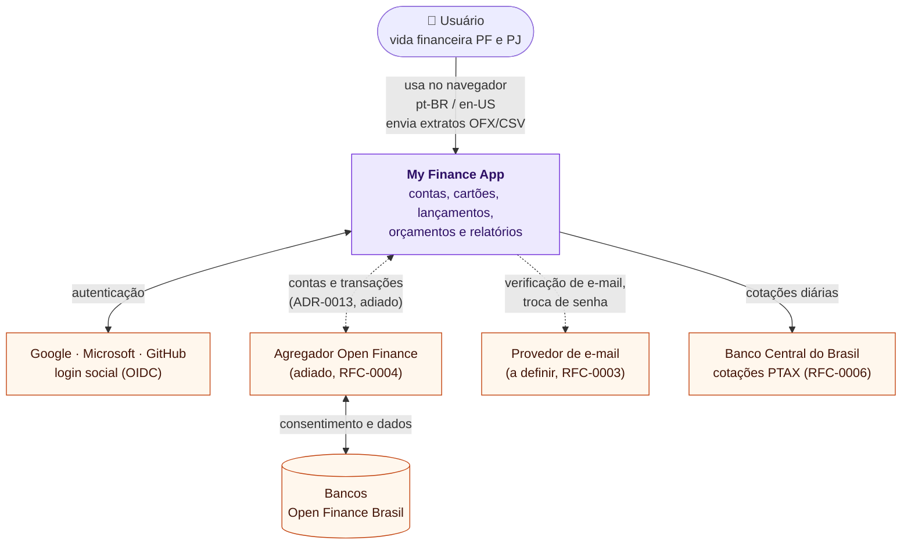
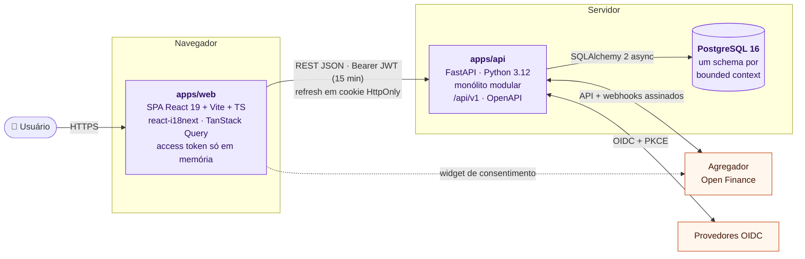
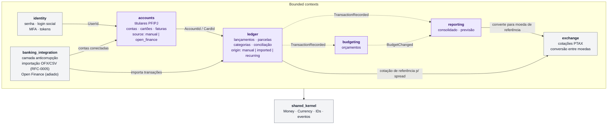
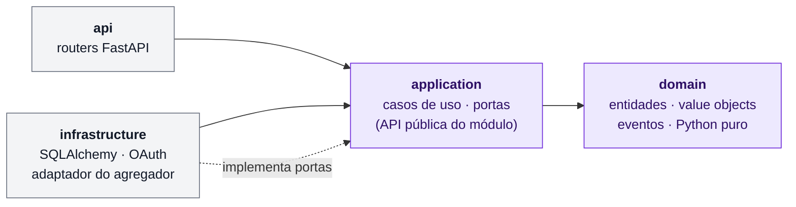
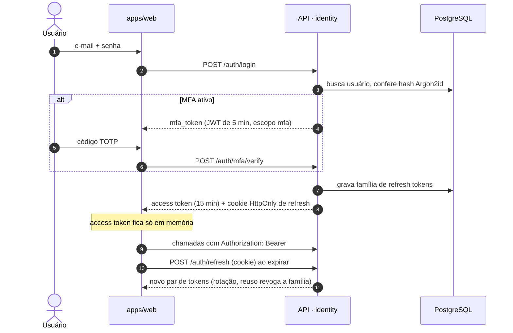
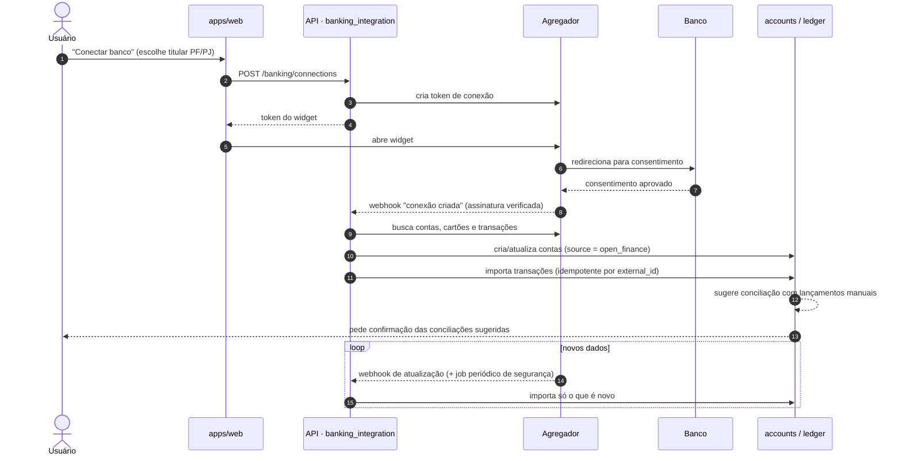

# Diagramas de arquitetura

Diagramas em [Mermaid](https://mermaid.js.org/). O GitHub renderiza direto nesta página.
Eles seguem os níveis do [modelo C4](https://c4model.com/): contexto → containers → componentes.
Atualize este arquivo no mesmo PR de qualquer ADR que mude a arquitetura.

**Legenda de cores:** roxo = núcleo do negócio · cinza = suporte · laranja = serviço externo ·
tracejado = assíncrono (eventos/webhooks) ou ainda a definir.

## 1. Contexto do sistema

Quem usa o sistema e com quais serviços externos ele conversa.

## 2. Containers

As peças que rodam separadamente. Decisões: [ADR-0002](../adr/0002-backend-fastapi.md),
[ADR-0003](../adr/0003-frontend-react-vite.md), [ADR-0005](../adr/0005-persistence-postgresql.md),
[ADR-0006](../adr/0006-authentication.md).

## 3. Bounded contexts dentro da API

Como o monólito modular é dividido ([ADR-0004](../adr/0004-modular-monolith-ddd.md),
[RFC-0002](../rfc/0002-domain-model.md), [ADR-0013](../adr/0013-account-sources-and-banking-integration.md)).
Setas cheias são chamadas à camada `application` de outro contexto. Setas tracejadas são
eventos de domínio. Nenhum contexto importa o interior de outro, e o `import-linter`
verifica isso no CI. Todas as requisições entram pela camada HTTP `/api/v1` (JWT,
`Accept-Language`, envelope de erro), que roteia para o `api` de cada contexto.

Cada contexto tem as mesmas quatro camadas, e as dependências só apontam para dentro:

## 4. Fluxos críticos

### Login com senha e MFA ([RFC-0003](../rfc/0003-authentication-and-mfa.md))

### Sincronização Open Finance ([RFC-0004](../rfc/0004-open-finance.md))

