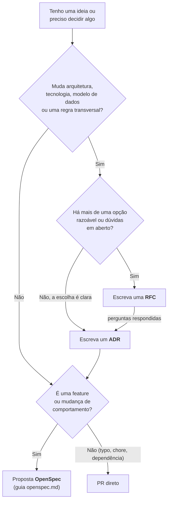
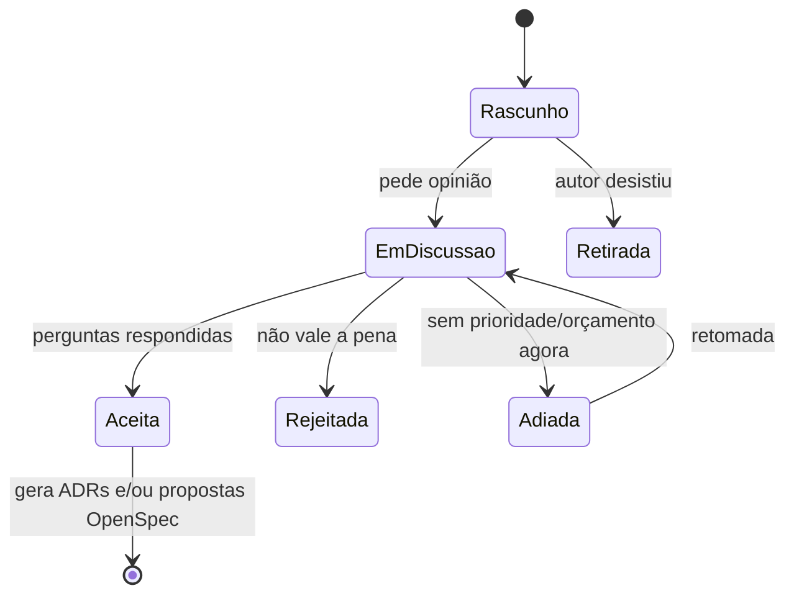
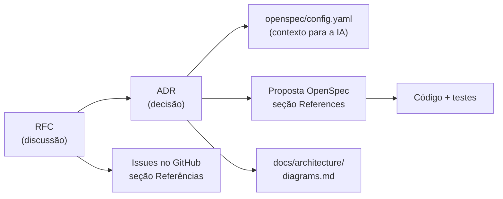

# Guia: como usar ADRs e RFCs

Este guia explica **quando** escrever um ADR ou uma RFC, **como** escrever, e como eles
se ligam ao OpenSpec e ao código. Vale para pessoas e para agentes de IA.

- ADRs ficam em [`docs/adr/`](../adr/README.md), com índice e [modelo](../adr/template.md).
- RFCs ficam em [`docs/rfc/`](../rfc/README.md), com índice e [modelo](../rfc/template.md).
- A regra de registrar decisões vem do [ADR-0001](../adr/0001-record-architecture-decisions.md).

## Em uma frase

- **RFC** = *"proponho isto, o que vocês acham?"* É uma discussão aberta, com opções,
  prós e contras e perguntas.
- **ADR** = *"decidimos isto, por este motivo."* É o registro curto e permanente de uma
  decisão tomada.

Uma RFC costuma **gerar** um ou mais ADRs. Um ADR pode existir sem RFC, quando a
decisão é simples e não precisa de debate.

## Qual escrever?



Exemplos reais deste repositório:

| Situação | O que foi feito |
|---|---|
| Escolher o stack (várias opções) | [RFC-0001](../rfc/0001-stack-options.md) → ADRs 0002, 0003 e 0004 |
| Registrar que dinheiro nunca é `float` (escolha óbvia) | Direto no [ADR-0007](../adr/0007-money-representation.md) |
| Importar OFX/CSV (viabilidade, bibliotecas, dúvidas) | [RFC-0005](../rfc/0005-statement-file-import.md) → [ADR-0014](../adr/0014-in-house-ofx-parser.md) (parser próprio) e [ADR-0015](../adr/0015-statement-import-in-banking-integration.md) (onde fica no código) |
| Adiar o Open Finance | Status da [RFC-0004](../rfc/0004-open-finance.md) mudou para "Adiada". Nenhum ADR foi desfeito. |

## Como escrever uma RFC

1. **Copie o modelo** com o próximo número livre (veja o índice):
   ```bash
   cp docs/rfc/template.md docs/rfc/0008-titulo-curto.md
   ```
2. **Preencha**, mantendo o foco no *porquê* e nas *opções*:
   - **Resumo:** um parágrafo.
   - **Motivação:** que problema do usuário resolve.
   - **Proposta detalhada:** o que muda, com diagramas se ajudar (Mermaid).
   - **Alternativas:** o que foi descartado e por quê.
   - **Perguntas em aberto:** checklist `- [ ]`. É aqui que o dono do produto decide.
   - **Fora de escopo:** evita que a discussão cresça sem fim.
3. **Adicione a linha no índice** [`docs/rfc/README.md`](../rfc/README.md).
4. **Status inicial:** `Rascunho` enquanto escreve, `Em discussão` quando pedir opinião.
5. **Registre as respostas** na própria RFC: marque `- [x]`, escreva a decisão e a data.
   Exemplo da RFC-0006:
   ```markdown
   - [x] Cotação de referência para o spread: **PTAX venda do dia da compra**,
         confirmada em 2026-09-23.
   ```
6. **Feche a RFC** mudando o status e listando os ADRs gerados no campo
   "ADRs resultantes".

### Ciclo de vida da RFC



Uma RFC **pode ser editada** enquanto está aberta. Depois de aceita, vira referência
histórica: novas mudanças de rumo vão numa nova RFC ou num novo ADR.

## Como escrever um ADR

1. **Copie o modelo** com o próximo número:
   ```bash
   cp docs/adr/template.md docs/adr/0018-titulo-no-imperativo.md
   ```
2. **Seja curto e específico.** Um ADR bom cabe numa tela:
   - **Contexto:** a força ou restrição que obrigou a decidir.
   - **Decisão:** em voz ativa ("Vamos usar…", "Contas têm…").
   - **Alternativas consideradas:** tabela com o motivo de cada descarte.
   - **Consequências:** o que fica mais fácil, mais difícil, e o que monitorar.
3. **Status:** normalmente `Aceito` quando registra algo já decidido. Use `Proposto` só
   se a decisão ainda depende de uma aprovação formal.
4. **Adicione a linha no índice** [`docs/adr/README.md`](../adr/README.md).
5. **Ligue as pontas:** cite a RFC de origem em "Relacionados" e atualize o campo
   "ADRs resultantes" da RFC.

### Regra de ouro: ADR aceito não se edita

Um ADR aceito é **imutável**. Se a decisão mudar:

1. Escreva um **novo ADR** explicando a mudança.
2. No ADR antigo, mude **só a linha de status** para
   `Substituído por [ADR-XXXX](XXXX-...)`.
3. Atualize o status nos dois índices.

Se a decisão não muda, mas **amplia** o escopo de um ADR anterior, escreva um novo ADR
que o complemente, sem substituir. Foi o caso do
[ADR-0015](../adr/0015-statement-import-in-banking-integration.md), que ampliou o
contexto criado pelo [ADR-0013](../adr/0013-account-sources-and-banking-integration.md).

Correções que não mudam o sentido (erro de digitação, link quebrado) podem ser feitas
direto.

## Como ADRs e RFCs se ligam ao resto



- **Propostas OpenSpec** precisam citar os ADRs e RFCs em que se apoiam (regra do
  `openspec/config.yaml`). Se a proposta contradiz um ADR, ela para até existir um novo ADR.
- **Issues** listam os ADRs e RFCs em "Referências" e as decisões pendentes em
  "Antes de implementar".
- **Diagramas** em [`docs/architecture/diagrams.md`](../architecture/diagrams.md) são
  atualizados no mesmo PR de qualquer ADR que mude a arquitetura.
- **Decisões de produto importantes** (ex.: multimoeda desde o início) também entram no
  `context` do [`openspec/config.yaml`](../../openspec/config.yaml), para que os agentes
  de IA as considerem.

## Pedindo ao Claude (ou outro agente)

Os agentes seguem o [`AGENTS.md`](../../AGENTS.md), que os obriga a ler ADRs e RFCs antes
de propor ou implementar. Alguns pedidos úteis:

- *"Verifique a viabilidade de X e escreva uma RFC."*
- *"Registre como ADR a decisão de usar Y."*
- *"A RFC-0007 tem perguntas em aberto: responda a primeira com Z e atualize os documentos."*
- *"Esta mudança contradiz algum ADR?"*

O agente deve atualizar índices, links cruzados, diagramas e issues no mesmo PR.

## Checklist antes do PR

- [ ] Número sequencial correto e nome de arquivo em `kebab-case`
- [ ] Status, data e "Relacionados"/"ADRs resultantes" preenchidos
- [ ] Linha adicionada no índice (`docs/adr/README.md` ou `docs/rfc/README.md`)
- [ ] Links cruzados atualizados (RFC ↔ ADR, issues, diagramas)
- [ ] Nenhum ADR aceito foi editado além da linha de status
- [ ] Diagramas Mermaid renderizam (o GitHub mostra um erro no lugar do diagrama se a
      sintaxe estiver errada)
- [ ] `make specs` e os hooks do pre-commit passam
