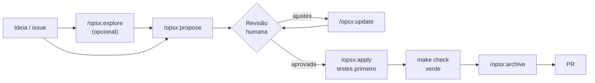

# Guia: como usar o OpenSpec

O [OpenSpec](https://github.com/Fission-AI/OpenSpec) é a ferramenta de
**desenvolvimento guiado por especificação** deste projeto
([ADR-0011](../adr/0011-spec-driven-development-and-ai-agents.md)). Toda feature começa
como uma **proposta escrita e revisada** e só depois vira código, com testes primeiro
([ADR-0009](../adr/0009-testing-strategy-tdd.md)).

Versão usada: **1.13.1**, sempre via `npx -y @fission-ai/openspec@1.13.1` (não precisa
instalar). Os exemplos abaixo usam `openspec` como atalho para esse comando.

## Conceitos

| Conceito | Onde fica | O que é |
|---|---|---|
| **Spec** | `openspec/specs/<capability>/spec.md` | O comportamento **atual** do sistema, por capacidade (ex.: `money`, `localization`). É a fonte de verdade. |
| **Change** (mudança) | `openspec/changes/<nome>/` | Uma proposta de alteração ainda não concluída. |
| **Delta** | `openspec/changes/<nome>/specs/<capability>/spec.md` | O que a mudança **acrescenta, altera ou remove** nas specs. |
| **Archive** | `openspec/changes/archive/AAAA-MM-DD-<nome>/` | Mudanças concluídas. Ao arquivar, os deltas são aplicados às specs. |
| **Config** | `openspec/config.yaml` | Contexto do projeto e regras que os agentes de IA seguem ao escrever propostas. |

Uma change tem quatro artefatos:

| Arquivo | Responde | Conteúdo |
|---|---|---|
| `proposal.md` | **Por quê?** | Motivação, o que muda, capacidades afetadas, *Non-goals*, *References* (ADRs e RFCs) |
| `specs/**/spec.md` | **O quê?** | Requisitos com cenários GIVEN/WHEN/THEN (os deltas) |
| `design.md` | **Como?** | Bounded contexts tocados, decisões técnicas, estratégia de testes |
| `tasks.md` | **Em que ordem?** | Checklist de tarefas pequenas, **teste antes da implementação** |

Exemplo completo e real: a mudança que criou o scaffold,
[`archive/2026-09-23-add-project-scaffold`](../../openspec/changes/archive/2026-09-23-add-project-scaffold).

## O fluxo



1. **Antes de tudo:** leia os ADRs e RFCs relacionados (guia
   [adr-and-rfc.md](adr-and-rfc.md)). Se a mudança exige uma decisão de arquitetura
   nova, ela vem **antes**, como RFC ou ADR.
2. **Explorar (opcional):** `/opsx:explore` para pensar em voz alta com o agente,
   investigar o código e esclarecer requisitos, sem criar arquivos.
3. **Propor:** `/opsx:propose <descrição ou issue>`. O agente cria a change com os
   quatro artefatos e **para**, sem escrever código.
4. **Revisar:** leia `proposal.md` e os cenários das specs. Esta é a etapa mais
   importante: é aqui que se corrige o rumo, antes de existir código.
5. **Ajustar:** `/opsx:update` para incorporar decisões e manter os artefatos
   coerentes entre si. Editar os arquivos à mão também vale.
6. **Implementar:** `/opsx:apply`. O agente segue o `tasks.md` em ordem, escrevendo o
   teste que falha antes de cada implementação, e marca `- [x]` a cada tarefa.
7. **Validar:** `make check` (lint, tipos, fronteiras, testes, specs), o mesmo que o CI.
8. **Arquivar:** `/opsx:archive`. Os deltas viram parte das specs em
   `openspec/specs/` e a change vai para `archive/`.
9. **PR:** abra o PR com o template preenchido, apontando para a change arquivada.

`/opsx:sync` aplica os deltas às specs **sem** arquivar a change. É útil numa mudança
longa, quando outra change precisa enxergar os requisitos novos antes da conclusão.

## Comandos por ferramenta

| Ação | Claude Code | GitHub Copilot | Outros agentes (`.agents/skills`) |
|---|---|---|---|
| Explorar | `/opsx:explore` | `/opsx-explore` | skill `openspec-explore` |
| Propor | `/opsx:propose` | `/opsx-propose` | skill `openspec-propose` |
| Ajustar | `/opsx:update` | `/opsx-update` | skill `openspec-update-change` |
| Implementar | `/opsx:apply` | `/opsx-apply` | skill `openspec-apply-change` |
| Sincronizar specs | `/opsx:sync` | `/opsx-sync` | skill `openspec-sync-specs` |
| Arquivar | `/opsx:archive` | `/opsx-archive` | skill `openspec-archive-change` |

Exemplo de pedido ao Claude:

```
/opsx:propose issue #2: persistência base com SQLAlchemy async, Alembic e schemas por contexto
```

## Comandos da CLI

Para usar no terminal, sem agente:

| Comando | Para quê |
|---|---|
| `openspec list` | Changes em andamento |
| `openspec list --specs` | Specs existentes (capacidades) |
| `openspec show <nome>` | Mostra uma change ou spec (`--type change\|spec` se houver ambiguidade) |
| `openspec show <change> --diff` | Diferença por requisito que a change aplica nas specs |
| `openspec status --change <nome>` | Quais artefatos da change estão prontos |
| `openspec validate --all --strict` | Valida todas as specs e changes (também em `make specs`) |
| `openspec new change <nome>` | Cria a pasta de uma change vazia (o `/opsx:propose` já faz isso) |
| `openspec archive <nome> --yes` | Arquiva a change e aplica os deltas |
| `openspec view` | Painel interativo de specs e changes |

Para desativar a telemetria anônima do OpenSpec, use `OPENSPEC_TELEMETRY=0`, como já
fazem o Makefile e o CI.

## Como escrever specs

### Formato de um delta

```markdown
# Spec Delta

## Purpose
(só para capacidade nova) Uma ou duas frases, com 50+ caracteres, sobre para que ela serve.

## ADDED Requirements

### Requirement: Nome do requisito
O sistema SHALL <comportamento observável>.

#### Scenario: Nome do cenário
- **GIVEN** <estado inicial>
- **WHEN** <ação>
- **THEN** <resultado esperado>
- **AND** <resultado adicional>
```

As seções de delta são:

| Seção | Quando usar | Cuidado |
|---|---|---|
| `## ADDED Requirements` | Requisito novo | — |
| `## MODIFIED Requirements` | Requisito existente que muda | Copie o **bloco inteiro** da spec atual e edite. O título precisa ser idêntico. O que faltar no bloco se perde ao arquivar. |
| `## REMOVED Requirements` | Requisito que deixa de existir | Inclua **Reason** e **Migration** |
| `## RENAMED Requirements` | Só troca de nome | Formato `FROM:` / `TO:` |

### Regras deste projeto

Vêm do [`openspec/config.yaml`](../../openspec/config.yaml), e os agentes as recebem
automaticamente:

- **Proposta:** seção *References* com os ADRs e RFCs usados, e seção *Non-goals*.
  Se contradisser um ADR aceito, para e pede um novo ADR.
- **Design:** nomeia os bounded contexts tocados e descreve a estratégia de testes.
- **Specs:** todo requisito tem cenário GIVEN/WHEN/THEN, e **cada cenário vira um teste
  automatizado**. Texto visível ao usuário é especificado em pt-BR e en-US, ou por
  chave de tradução.
- **Tasks:** cada tarefa de implementação é precedida pela tarefa que escreve o teste
  que falha. Tarefas de no máximo 2 horas.

### O que vai (e não vai) na spec

A spec descreve **comportamento observável**: entradas, saídas, erros, regras de negócio.
Nomes de classes, bibliotecas e detalhes de implementação ficam no `design.md`.
Um teste rápido: se a implementação pode mudar sem mudar o que o usuário ou outro
sistema percebe, não é assunto da spec.

Dos cenários às specs e aos testes, no scaffold:

| Cenário na spec | Teste |
|---|---|
| `money` → *Exact addition* | `apps/api/tests/unit/shared_kernel/test_money.py::TestExactDecimals::test_exact_addition` |
| `localization` → *Unknown route in English* | `apps/api/tests/integration/test_localization.py::test_unknown_route_returns_localized_error` |
| `localization` → *Switch to English* | `apps/web/src/app/App.test.tsx` → *switches to English and remembers the choice* |

## Validação automática

- **pre-commit:** o hook `openspec validate` roda quando algo em `openspec/` muda.
- **CI:** o job *OpenSpec validate* roda `validate --all --strict` em todo PR.
- **Local:** `make specs`.

## Problemas comuns

| Sintoma | Causa e solução |
|---|---|
| `Purpose ... too brief` no `--strict` | A seção `## Purpose` de uma capacidade nova precisa de 50+ caracteres. |
| Cenário "some" ou a validação diz que o requisito não tem cenário | O cenário precisa de exatamente **quatro** `#` (`#### Scenario:`). Três `#` ou bullets falham em silêncio. |
| Ao arquivar, parte de um requisito sumiu da spec | O `MODIFIED` foi escrito com o bloco incompleto. Sempre copie o requisito inteiro. |
| `validate` reclama de change sem delta | Mudança sem comportamento novo (só tooling ou docs) não precisa de change OpenSpec. Se precisar mesmo, use `skip_specs: true` no `.openspec.yaml` da change. |
| Comandos `/opsx:*` não aparecem | Reinicie o Claude Code ou a IDE. Para regenerar os arquivos das ferramentas, rode `openspec update`. |

## Quando **não** usar OpenSpec

- Mudanças de CI, dependências, tooling e documentação, sem comportamento do produto
  (ex.: o release-please, ADR-0017).
- Correções triviais (typo, link).
- Decisões de arquitetura puras, que vão para ADR ou RFC.

Na dúvida, se o usuário percebe a diferença, é OpenSpec.
