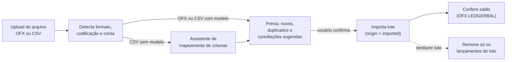

# RFC-0005: Importação de extratos em OFX e CSV

- **Status:** Em discussão. Prioridade decidida: **OFX primeiro, antes do Open Finance** (2026-09-23).
- **Autor(es):** Hitomi Growth + Claude Code
- **Criada em:** 2026-09-23
- **ADRs resultantes:** [ADR-0014](../adr/0014-in-house-ofx-parser.md) (parser OFX próprio), [ADR-0015](../adr/0015-statement-import-in-banking-integration.md) (importação dentro de `banking_integration`).

## Resumo

Permitir que o usuário envie arquivos de extrato **OFX** e **CSV** exportados pelo
internet banking, para contas e cartões **manuais**. Os lançamentos entram como
`origin = imported` e reaproveitam o que a RFC-0004 já define para Open Finance:
importação idempotente e conciliação com lançamentos digitados, sempre confirmada
pelo usuário.

**Conclusão da análise: é viável, com esforço baixo a médio.** O modelo de domínio
já comporta a feature (ADR-0013). OFX é o caso mais simples e confiável. CSV é
viável, mas exige um assistente de mapeamento de colunas, porque cada banco usa um
formato diferente.

## Motivação

- Traz **automação sem custo recorrente**, porque não depende de agregador pago.
  Pode ser entregue **antes** do Open Finance.
- Cobre bancos e instituições fora do Open Finance, e também períodos anteriores ao
  consentimento.
- Permite migrar o histórico de planilhas ou de outros apps (CSV).

## Análise de viabilidade

### OFX

| Aspecto | Situação |
|---|---|
| Disponibilidade | A maioria dos bancos brasileiros exporta OFX, para conta corrente e, em muitos casos, para fatura de cartão. |
| Versões | **OFX 1.x (SGML)**, a mais comum no Brasil, e **OFX 2.x (XML)**. As duas precisam ser suportadas. |
| Identificador único | Cada transação tem **`FITID`**, que vira o `external_id` e garante idempotência. |
| Conta de origem | `BANKACCTFROM` (banco, agência/conta) ou `CCACCTFROM` (cartão). Permite sugerir a conta de destino automaticamente. |
| Saldo | `LEDGERBAL` permite validar o saldo após a importação, com a mesma regra de divergência da RFC-0004. |

**Particularidades dos bancos brasileiros que o parser precisa tolerar:**
- Codificação **Windows-1252/Latin-1** declarada de forma errada no cabeçalho.
- Datas com fuso no formato `20260115120000[-3:BRT]`.
- Tags SGML sem fechamento e valores com vírgula decimal em alguns bancos.
- **`FITID` instável** em alguns bancos (muda entre exportações ou se repete no mesmo
  dia). Mitigação: quando o `FITID` repetir dentro do arquivo, ou quando o banco
  estiver marcado como instável, usar a identidade sintética descrita no CSV.

**Bibliotecas avaliadas (PyPI, set/2026):**

| Opção | Licença | Situação | Avaliação |
|---|---|---|---|
| `ofxtools` 1.1.1 | **GPL-3.0-only** | Mantida (release em jun/2026) | Robusta, mas a GPL é incompatível com a licença MIT do repositório e tem implicações na publicação das imagens Docker. **Não recomendada.** |
| `ofxparse` 0.21 | MIT | Sem release desde mai/2021 | Licença compatível, mas parada. É um risco para as particularidades brasileiras. |
| **Parser próprio** | MIT (nosso) | — | OFX 1.x SGML é simples. Algumas centenas de linhas cobrem o subconjunto necessário (conta, cartão, transações, saldo), e o TDD fica fácil com arquivos reais anonimizados de cada banco. XML 2.x lido com `defusedxml`. **Recomendado.** |

**Teste do `ofxparse` 0.21 (2026-09-23).** Rodamos a biblioteca em Python 3.12 contra 8
arquivos OFX **sintéticos**, montados a partir de particularidades conhecidas dos bancos
brasileiros. Não são arquivos reais.

| Caso | Resultado |
|---|---|
| SGML 1.x em Windows-1252, datas `[-3:BRT]`, acentos | ✅ OK |
| Valor com vírgula decimal | ✅ OK |
| Data sem hora | ✅ OK |
| Fatura de cartão (`CCSTMTRS`) | ✅ OK |
| `FITID` repetido no arquivo | ⚠️ Aceita em silêncio (tratamos na nossa camada de qualquer forma) |
| Cabeçalho diz UTF-8, mas o arquivo está em Latin-1 | ❌ Falha (`UnicodeDecodeError`) |
| **OFX 2.x (XML) com acento em UTF-8** | ❌ **Falha** (`UnicodeDecodeError`: tenta ler como ASCII) |
| Tentativa de XXE | ✅ Não resolve a entidade, mas corrompe o texto do campo |
| **Fuso horário**: compra em 31/01 às 22:00 BRT | ❌ **Devolve 01/02 01:00**, sem fuso. Converte para UTC e descarta a informação, então a transação muda de dia e até de mês, o que afeta orçamentos e relatórios. |

Além disso: último release em mai/2021, classificadores só até Python 3.6, e
dependências de `beautifulsoup4`, `lxml` e `six`. Os problemas de codificação e de
fuso podem ser contornados, mas exigem pré-processar o arquivo e reinterpretar as
datas cruas, o que na prática é reescrever as partes difíceis do parser.

**Recomendação mantida: parser próprio.** O `ofxparse` falha justamente nos pontos que
mais importam para o domínio: data correta do lançamento, OFX 2.x e codificação. Os 8
casos acima viram os primeiros testes do parser (TDD).

### CSV

| Aspecto | Situação |
|---|---|
| Padrão | **Não existe.** Cada banco muda separador (`;` ou `,`), decimal (`1.234,56` ou `1234.56`), formato de data, codificação, linhas de cabeçalho e rodapé, e a forma do valor (coluna com sinal ou colunas separadas de débito e crédito). |
| Identificador único | Normalmente não há. |
| Solução | **Assistente de mapeamento** com prévia: o usuário indica quais colunas são data, descrição, valor ou débito/crédito, e categoria (opcional). O mapeamento fica salvo como **modelo** por conta, e os próximos arquivos da mesma conta são importados sem configuração. |
| Detecção automática | Separador, codificação (`charset-normalizer`, MIT), formato de data e de decimal são sugeridos a partir das primeiras linhas. O usuário confirma na prévia. |
| Idempotência | **Identidade sintética**: hash de conta + data + valor + descrição normalizada + ordem da ocorrência no mesmo dia. A ordem da ocorrência separa duas compras idênticas no mesmo dia. |
| Migração | Um **modelo padrão do app** (colunas documentadas) facilita migrar de planilhas e de outros apps. |

## Proposta detalhada

### Fluxo

### Regras

1. Importação vale para contas e cartões com `source = manual`. Em contas conectadas
   via Open Finance, o arquivo só completaria períodos antigos. Se isso for desejado,
   será decidido na RFC-0004.
2. Cada upload vira um **lote de importação** (`ImportBatch`), com arquivo de origem,
   contagens (novos, duplicados, conciliados, ignorados) e opção de **desfazer** o lote
   inteiro.
3. Duplicados (mesmo `external_id` na mesma conta) são ignorados e aparecem na prévia.
4. Conciliação com lançamentos manuais segue a regra 3 da RFC-0004, com o mesmo código.
5. Categorias: sugestão pelo histórico do usuário. No CSV, a coluna de categoria pode
   ser mapeada.
6. O arquivo original não é guardado depois do processamento (minimização de dados,
   LGPD). Ficam apenas os metadados do lote.

### Onde fica no código

| Opção | Prós | Contras |
|---|---|---|
| **A. Dentro de `banking_integration`**, como mais um adaptador de entrada | Um só lugar para "dados financeiros vindos de fora". Reaproveita normalização e idempotência. | Amplia o escopo definido no ADR-0013 (exige novo ADR). |
| B. Novo contexto `statement_import` | Isolamento máximo. | Duplica normalização e conciliação, ou cria dependência entre os dois contextos. |

**Recomendação: opção A**, renomeando o conceito para "integração de dados
bancários". A porta `BankingProvider` ganha uma irmã, `StatementFileParser`, e
`accounts`/`ledger` continuam sem saber de onde o dado veio.

### Segurança

- Limite de tamanho do upload (ex.: 5 MB) e de linhas por arquivo.
- XML (OFX 2.x) lido com `defusedxml`, sem entidades externas (proteção contra XXE e
  "billion laughs").
- Validação de tipo pelo conteúdo, não pela extensão.
- Uma exportação futura para CSV deve neutralizar fórmulas (CSV injection).

## Esforço estimado

| Entrega | Tamanho | Depende de |
|---|---|---|
| Parser OFX (1.x e 2.x) com arquivos de teste de 4 a 5 bancos grandes | Médio | #11 |
| Lote de importação, prévia, desfazer e deduplicação | Médio | #11 |
| Importação CSV com assistente de mapeamento e modelos salvos | Médio/Grande | lote de importação |
| Conciliação com lançamentos manuais | Compartilhada com #23 | #11 |

## Alternativas

| Opção | Por que não |
|---|---|
| Só Open Finance | Custo recorrente e cobertura parcial. O arquivo complementa. |
| Só CSV | OFX é mais confiável (tem `FITID` e saldo) e menos trabalhoso para o usuário. |
| Aceitar PDF de extrato/fatura | Extração frágil. Candidato futuro para IA (issue #19), fora desta RFC. |

## Perguntas em aberto

- [x] Parser próprio ou `ofxparse`? **Parser próprio**, confirmado em 2026-09-23 ([ADR-0014](../adr/0014-in-house-ofx-parser.md)).
- [x] Opção A ou B? **Opção A**, dentro de `banking_integration`, confirmada em 2026-09-23 ([ADR-0015](../adr/0015-statement-import-in-banking-integration.md)).
- [x] Priorizar a importação de arquivos antes do Open Finance? **Sim.** Decidido pelo
      dono do produto em 2026-09-23: não haverá contratação de agregador por enquanto.
      Ordem: OFX → CSV → (Open Finance, quando houver orçamento).
- [x] Bancos em uso: **PF**: Itaú, Nubank, BTG. **PJ**: Itaú, InfinitePay, C6. O dono do
      produto exportará arquivos de exemplo quando a issue #25 começar. Ainda falta
      confirmar quais desses oferecem exportação em OFX (conta e cartão). Os que só
      exportarem CSV entram pela issue #28.
- [ ] Exportação para CSV também entra no escopo, ou fica para depois?

## Fora de escopo

PDF de extrato ou fatura, formatos QIF/QFX, importação automática por e-mail.
